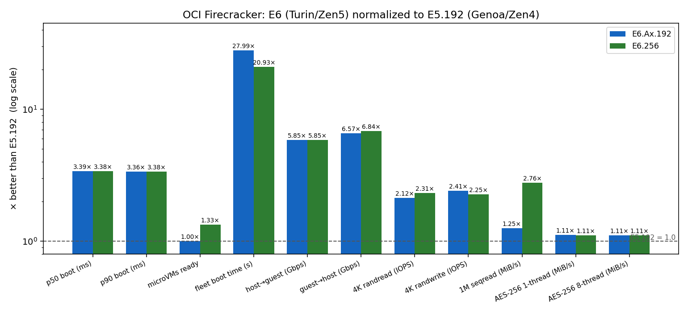
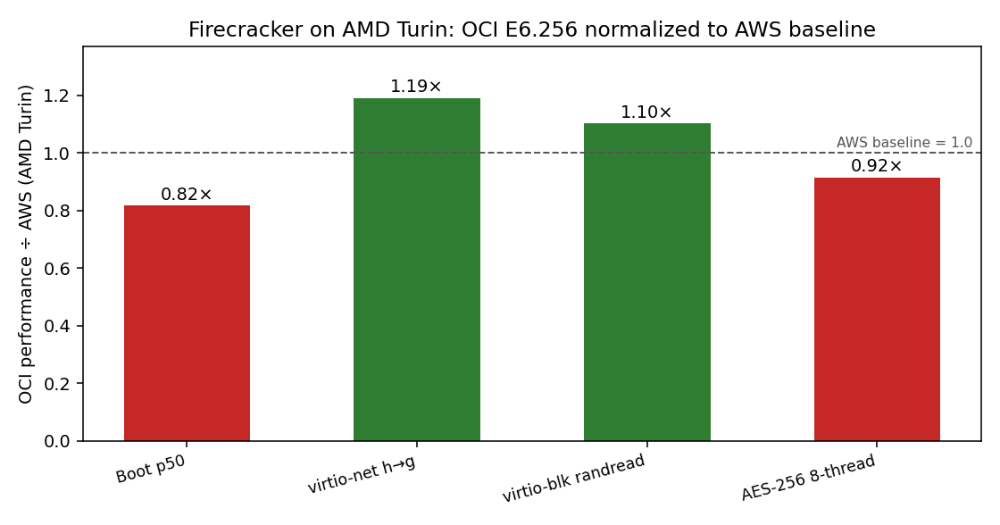

# Firecracker microVM performance: AMD EPYC on OCI and AWS

*OCI bare-metal · Ashburn (us-ashburn-1) · Firecracker v1.16.1 · kernel 6.8.0-1057-oracle · THP madvise · generated from run 2026-08-28T22:19:15Z*

> **Note on Intel:** OCI has no same-generation Intel bare-metal shape (the only Intel bare-metal, `BM.Standard4.Ax`, was not available in-region), so this study compares AMD generations — EPYC **Genoa (Zen4)** vs **Turin (Zen5)** — rather than AMD vs Intel. A companion AWS study (AMD Turin vs Intel Granite Rapids) remains the cross-vendor reference.

## Executive summary

The same five-metric Firecracker suite was run on three OCI AMD bare-metal shapes under an identical Firecracker build, guest kernel, and golden rootfs. The core-matched pair — **E5.192 (Genoa/Zen4)** and **E6.Ax.192 (Turin/Zen5)**, both 384 threads — isolates the generational step; **E6.256** is the larger 512-thread flagship.

The cleanest, storage-independent generational signal is **in-guest AES-256** (AES-NI/VAES): per-thread it rises from **980.8 → 1,089.6 MiB/s** (1.11× higher (E6.Ax)), and at 8 threads **7,845.9 → 8,676.2 MiB/s** (1.11× higher (E6.Ax)) — a ~8–11% per-thread Zen5 uplift.

The other metrics are reported **as-shipped**: E6 shapes include **local NVMe**, while **E5.192 has none** and ran on a standard iSCSI block volume (the only option for that shape). Boot latency, density fleet-boot, and block IOPS therefore reflect the **shape as a package** (CPU *and* its bundled storage), not the CPU alone — which is exactly what a customer deploying the shape experiences. See the storage note below.

## Full results

| Metric | E5.192 (Zen4) | E6.Ax.192 (Zen5) | E6.256 (Zen5) |
|---|---|---|---|
| **Boot latency (cold-start, fast-init)** | | | |
| p50 boot (ms) † | 414.1 | 122.3 | 122.5 |
| p90 boot (ms) † | 415.9 | 123.7 | 123.2 |
| **Fleet density (256 MiB/VM)** | | | |
| microVMs ready | 384 | 384 | 512 |
| fleet boot time (s) † | 48.98 | 1.75 | 2.34 |
| **Network (virtio-net, iperf3)** | | | |
| host→guest (Gbps) | 8.7 | 50.8 | 50.7 |
| guest→host (Gbps) | 8.6 | 56.4 | 58.7 |
| **Block I/O (virtio-blk, fio direct)** | | | |
| 4K randread (IOPS) † | 110,256 | 233,852 | 255,019 |
| 4K randwrite (IOPS) † | 88,539 | 213,707 | 199,577 |
| 1M seqread (MiB/s) † | 8,507 | 10,652 | 23,476 |
| **Guest compute (in-VM)** | | | |
| AES-256 1-thread (MiB/s) | 980.8 | 1,089.6 | 1,086.7 |
| AES-256 8-thread (MiB/s) | 7,845.9 | 8,676.2 | 8,681.6 |

† = storage-sensitive (E6 on local NVMe, E5 on iSCSI block volume).

*Each metric normalized to **E5.192 = 1.0** (dashed line): bars show how many times better E6.Ax.192 and E6.256 are (for boot latency and fleet-boot, "better" means lower, so the ratio is inverted). **Log scale** — the improvements span 1.1× (AES) to ~28× (fleet boot), so a linear axis would hide the smaller ones. Storage-fed metrics (boot, block, fleet-boot) carry E6's local-NVMe advantage; AES is the pure CPU-generation step.*

## Methodology notes

**Storage is a real shape difference, not normalized away.** E6.Ax.192 and E6.256 ship with local NVMe; E5.192 has no local NVMe, so its Firecracker working set (guest rootfs + overlays) ran on an attached iSCSI block volume. We deliberately did **not** normalize storage (e.g. via a RAM disk) because a customer deploys the shape as-shipped: an E6 tenant gets local NVMe, an E5 tenant must attach block storage. The storage-sensitive rows (†) therefore reflect the true as-deployed experience. The pure CPU-generation signal is carried by AES-256, which is storage-independent.

**Density is thread-capped.** At 256 MiB/VM every host saturates at one microVM per hardware thread (E5.192 & E6.Ax.192: 384; E6.256: 512) long before RAM is exhausted, so density scales with thread count, not a memory advantage.

**Network gap larger than the CPU step alone.** The E5→E6 virtio-net ratio is much bigger than the ~1.1× seen on the pure-CPU AES metric. virtio-net throughput is driven by the host vhost worker and is sensitive to NUMA placement of the guest vCPUs, the TAP, and the vhost thread — none of which the harness pins. On the dual-socket E5 this can split the data path across sockets and depress throughput. The E5 network figure (measured consistently at ~8.6 Gbps across directions) should be treated as a floor pending a NUMA-pinned re-measurement, not as the ceiling of Genoa's virtio-net capability.

**matrixprod excluded.** A stress-ng matrixprod stressor is collected but excluded from conclusions (it dispatches into Intel AMX on Intel parts — an ISA AMD does not expose). AES-256-GCM is the retained compute benchmark; both AMD generations support AES-NI/VAES.

## Test configuration

| Shape | CPU | Sockets × cores | Threads | RAM | Local storage |
|---|---|---|---|---|---|
| E5.192 (Genoa / Zen4) | AMD EPYC 9J14 96-Core Processor | 2 × 96 | 384 | 2267 GiB | none (iSCSI block volume) |
| E6.Ax.192 (Turin / Zen5) | AMD EPYC 9J45 128-Core Processor | 2 × 96 | 384 | 1511 GiB | 2×960 GB NVMe |
| E6.256 (Turin / Zen5) | AMD EPYC 9J45 128-Core Processor | 2 × 128 | 512 | 3023 GiB | 2×960 GB NVMe |

## OCI cost & price-performance

List prices (US$, pre-discount): OCI E-series bills **$0.0250 per OCPU-hour + $0.0015 per GB-hour**, and **E6 is priced the same per-OCPU as E5** — so E6's performance gains come at no per-core premium. Bare-metal OCPU/memory are fixed; 1 OCPU = 2 vCPUs (2 hardware threads). These are list rates before any committed-use or negotiated discount — override with `OCI_OCPU_RATE` / `OCI_MEM_RATE` to use your own.

| Shape | OCPU | RAM (GB) | OCPU $/hr | Memory $/hr | **Total $/hr** | ~$/month (730 h) |
|---|---|---|---|---|---|---|
| E5.192 | 192 | 2,267 | 4.80 | 3.40 | **8.20** | 5,987 |
| E6.Ax.192 | 192 | 1,511 | 4.80 | 2.27 | **7.07** | 5,159 |
| E6.256 | 256 | 3,023 | 6.40 | 4.53 | **10.93** | 7,982 |

### Price-performance: microVM density economics

For a Firecracker / serverless host the money metric is **cost per microVM-hour** — how cheaply you can host each 256-MiB guest — and its inverse, microVMs per dollar-hour. (microVM count is thread-capped, so it scales with OCPU; the differentiator is how much you pay in memory for those threads.)

| Shape | microVMs (256 MiB) | Total $/hr | **$ per microVM-hour** | microVMs per $/hr |
|---|---|---|---|---|
| E5.192 | 384 | 8.20 | **$0.0214** | 46.8 |
| E6.Ax.192 | 384 | 7.07 | **$0.0184** | 54.3 |
| E6.256 | 512 | 10.93 | **$0.0214** | 46.8 |

*Cost per microVM-hour in US$; lower is better. Density is one microVM per hardware thread at 256 MiB.*

**Read:** on pure density economics, **E6.Ax.192** is the best value at **$0.0184 per microVM-hour** — it packs the most guests per dollar. E6.256 costs more per hour (more OCPUs + memory) but also hosts more microVMs, so its per-microVM cost lands close to E5; the E6 win is that you get Turin's ~2× throughput and local NVMe at the **same per-OCPU price** as E5. Because the storage-fed metrics (boot, block) are far better on E6's local NVMe, E6's *performance* per dollar on those axes is dramatically higher than the raw density numbers alone suggest.

> Pricing is OCI public list price and may not reflect your committed-use/negotiated rate; treat the dollar figures as relative, not billing-accurate.

## Cross-cloud: AMD Turin on OCI vs AWS

Same silicon generation (AMD EPYC Turin/Zen5), different cloud. OCI **E6.256** (local NVMe) vs the two AWS Turin metal hosts from the companion AWS study — **c8a** (compute) and **m8a** (general-purpose), both EPYC 9R45, Turin + local NVMe. The two AWS hosts share the same silicon (they differ only in RAM class), so their per-guest numbers are near-identical; the ratio column compares OCI to their geometric mean (the same pair-geomean method used in the AWS study). This isolates the *cloud platform* (host kernel, VMM tuning, storage, power limits) on matched silicon.

| Metric | c8a (AWS) | m8a (AWS) | OCI E6.Ax.192 | OCI E6.256 | E6.Ax vs AWS | E6.256 vs AWS |
|---|---|---|---|---|---|---|
| Boot p50 (ms) | 99.7 | 100.5 | 122.3 | 122.5 | 0.82× (AWS) | 0.82× (AWS) |
| virtio-net h→g (Gbps) | 45.4 | 40.0 | 50.8 | 50.7 | 1.19× (OCI) | 1.19× (OCI) |
| virtio-blk randread (IOPS) | 209,482.0 | 254,866.0 | 233,852.0 | 255,019.0 | 1.01× (OCI) | 1.10× (OCI) |
| AES-256 8-thread (MiB/s) | 9,482.8 | 9,478.8 | 8,676.2 | 8,681.6 | 0.92× (AWS) | 0.92× (AWS) |

*Ratios normalized so >1.0 means OCI beats the AWS AMD baseline on that metric (boot is inverted — lower latency is better). Baseline = geomean of c8a and m8a. The two OCI Turin shapes track each other closely, as expected for identical silicon.*

*Bars: OCI E6.Ax.192 and E6.256 normalized to the AWS AMD Turin baseline (dashed line = AWS = 1.0). Above the line = OCI advantage.*

**Read:** OCI's AMD Turin leads on virtio-net and virtio-block but trails slightly on cold-start boot and full-socket AES — a mixed result, not a clean sweep. The boot and AES gaps are small and plausibly reflect host-kernel/VMM tuning and per-SKU clock/power-limit differences (OCI 9J45 vs AWS 9R45 custom Turin parts), not an architectural difference.
